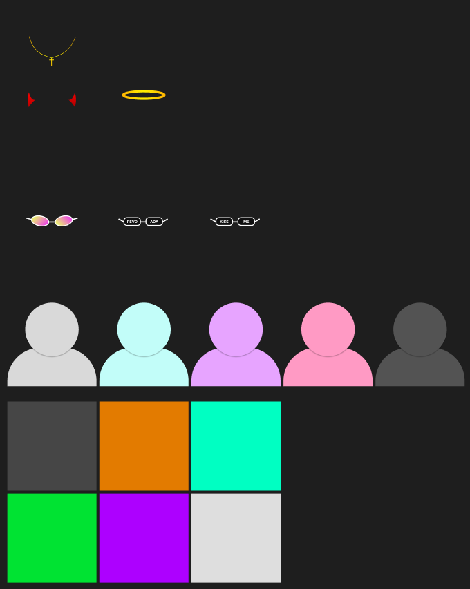
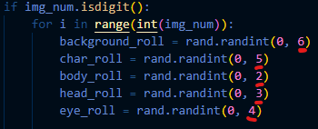
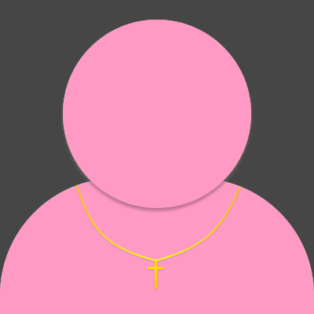

## User guide

# 1. Download the source code

# 2. Install dependencies (Pillow, os, numpy)
pip install Pillow  
pip install os  
pip install numpy

# 3. Design and Place your assets on the desired folders

  

Note: Is necessary that your assets have the same size.    
Note2: If you want to have versions without one of your layers, you have to place a fully transparent image on the layer folder.

# 4. Change the second number with the number of assets you have of each layer

# 5. Run the code and generate awesome images =)

  

